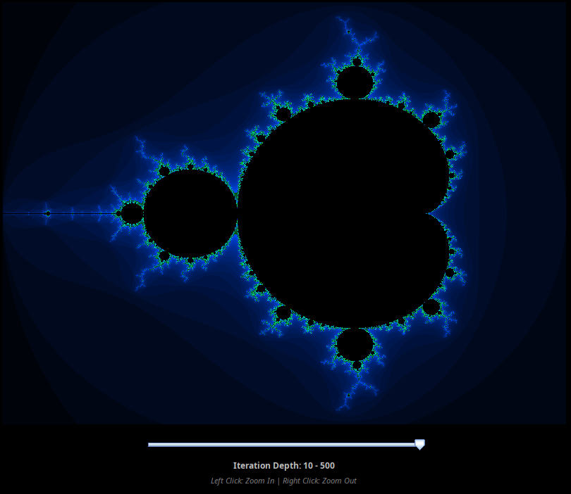
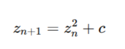

# Fractal de Mandelbrot com Integração Java + C (JNI)

**Autoras**: Andressa Von Ahnt e Eduarda Fernandes

Conceitos de Linguagens de Programação

Prof. Dr. Gerson Cavalheiro

## Descrição do Projeto

Este projeto implementa uma aplicação gráfica para geração do **Fractal de Mandelbrot**, utilizando duas linguagens de programação com vocações distintas:

* **Java**: Interface gráfica com `Swing` e interação com o usuário
* **C**: Serviço de cálculo eficiente do fractal

A comunicação entre as linguagens foi feita via **JNI (Java Native Interface)**




# Arquitetura do Projeto

```
├── Mandelbrot.java        # Interface gráfica (Java + Swing)
├── mandelbrot.c           # Implementação do cálculo do fractal (C)
├── Makefile               # Automação de compilação e execução
├── README.md              # Documentação do repositório
├── documentação.pdf       # Documentação da implementação 
└── images/
    └── mandelbrot.png
```

# Interface Gráfica (Java)

Arquivo: `Mandelbrot.java`

Responsável por:

* Criar janela gráfica (`JFrame`)
* Renderizar imagem (`BufferedImage`)
* Controlar zoom com mouse
* Controlar profundidade de itações com slider
* Gerenciar estado do plano complexo
* Chamar a função nativa implementada em C

A imagem é manipulada via um array de inteiros (`int[] pixels`) que é passado diretamente para o código em C.


# Serviço de Cálculo (C)

Arquivo: `mandelbrot.c`

Responsável por:

* Implementar o algoritmo do fractal
* Calcular a divergência para cada pixel
* Escrever diretamente no buffer de pixels fornecido pelo Java

O cálculo utiliza o seguinte método:



onde:

* ( z ) é um número complexo
* ( c ) representa cada ponto do plano complexo
* A divergência é verificada pelo módulo ( |z| > 2 )


# Comunicação Entre as Linguagens (JNI)

A integração é feita usando **Java Native Interface (JNI)**.

### Fluxo de Execução:

1. Java declara o método nativo:

```java
public native void calcularMandelbrot(...)
```

2. A biblioteca nativa é carregada:

```java
System.loadLibrary("mandelbrot");
```

3. O Makefile gera automaticamente o header JNI.

4. O código C implementa a função correspondente.

5. O Java passa o array de pixels para o C.

6. O C escreve diretamente na memória.

7. O Java apenas redesenha a imagem.

Esse mecanismo permite integração eficiente entre as linguagens com baixo custo de comunicação.


# Makefile Multiplataforma

O `Makefile` foi desenvolvido para funcionar no **Linux**.

Ele detecta automaticamente o PATH do jdk e cria o (.so).


### Comandos disponíveis:

```
make        # Compila o projeto
make run    # Executa a aplicação
make clean  # Remove arquivos gerados
```


# Como Compilar

## Requisitos

* SO Linux
* JDK instalado
* GCC ou compilador C equivalente
* Make
* Variável JAVA_HOME configurada

## Compilação

```
make
```

O processo executa automaticamente:

1. Compilação do Java
2. Geração do header JNI
3. Compilação do código C
4. Geração da biblioteca (.so)


# Como Executar

```
make run
```

# Funcionalidades da Aplicação

- Renderização do fractal
- Controle de profundidade de iteração
- Zoom interativo com mouse
- Comunicação direta entre C e Java
- Escrita direta no buffer de imagem

